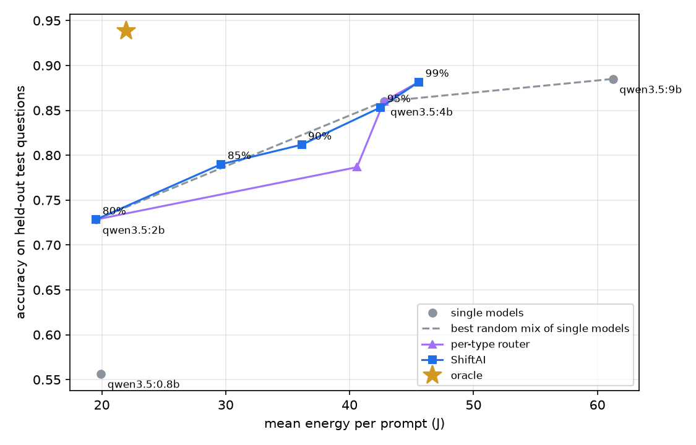

# ShiftAI: Adaptive LLM Routing for Resource-Efficient Local AI

[](https://github.com/Jaswant06/shiftai-router/actions/workflows/tests.yml)


ShiftAI is an installable router for local language models. For every prompt it
predicts how well each model on your computer would answer, then sends the
prompt to the **cheapest model that keeps the quality you asked for**, instead
of running everything through the largest model. Easy prompts go to a small,
fast model; hard prompts go to a big one.

> Ask a question -> ShiftAI predicts each model's quality and cost on *your*
> machine -> the smallest model that is good enough answers.

```text
$ shiftai ask "Write a polite two-sentence email declining a meeting on Friday." --quality 90 --explain
Quality target: 90% of the largest model (latency optimised)
model                    pred. quality  relative  est. time  est. energy  loaded
qwen3.5:0.8b                      0.47       60%      3.71s          n/a
qwen3.5:2b                        0.58       74%      5.41s          n/a
qwen3.5:4b                        0.76       97%      7.87s          n/a
qwen3.5:9b                        0.78      100%     11.83s          n/a
Selected: qwen3.5:4b  (cheapest model predicted close enough to the largest for your quality target)
Prompt familiarity: high   Router overhead: 35 ms
```

**Headline result (760 held-out prompts, Apple M5):** at the 90% setting
ShiftAI kept **89.9%** of the 9B model's quality while answering **44% faster**
with **40% less energy**. On everyday open-ended requests (writing, questions,
brainstorming, summaries) it kept **94%** of the 9B's quality at **46% less
latency** and **36% less energy**. [Full results below](#results), including
where a simple baseline does just as well.

**[Try the live demo](https://huggingface.co/spaces/JaswantDev/shiftai-router)**: the real router running in your browser, plus
the actual answers all four models gave on held-out test prompts.

## Why route at all

Local models are a ladder of trade-offs: a 0.8B model answers in a fraction of a
second, a 9B model is much smarter but slower and uses far more energy. Most
apps pick one model and send it everything, so either easy prompts waste time
and battery on a big model, or hard prompts get weak answers from a small one.
ShiftAI makes that choice per prompt.

## How it works

ShiftAI splits the decision into two questions, because they depend on
different things:

1. **Which models can answer this well?** This depends only on the prompt, so
   it is learned once, offline, and shipped with the package.
2. **What does each model cost on this machine, right now?** This depends on
   the hardware and its current state, so it is measured locally.

```text
prompt -> type + embedding -> capability predictor -> P(good answer) per model
                                                               |
local hardware profile + loaded models + battery ----> estimated cost per model
                                                               |
                         cheapest model meeting the quality target -> answer
```

- **Capability predictor:** prompts are split by type (multiple choice or
  open-ended) and grouped into clusters of similar prompts using a
  `nomic-embed-text` embedding. Each cluster stores every model's measured
  quality, shrunk toward the type average so small clusters stay sensible. A
  new prompt gets the estimates of its nearest cluster
  (`src/shiftai/predictor.py`). A per-prompt logistic regression was tried and
  rejected; see [what did not work](#what-did-not-work).
- **Relative quality target:** `--quality 90` means "keep at least 90% of what
  the largest model would score". The router takes the cheapest model predicted
  to reach at least (1 - delta) of the largest model's quality. For each target,
  the number of clusters and delta are tuned on out-of-fold predictions so the
  routed quality over the whole workload meets the target
  (`src/shiftai/policy.py`). `--quality 100` simply uses the largest model.
- **Cost model:** `shiftai setup` measures each model's cold load time, prompt
  speed, generation speed, memory and power on your machine
  (`src/shiftai/calibrate.py`). At decision time ShiftAI checks which models are
  already loaded (loading a model can cost seconds) and whether you are on
  battery, in which case it ranks models by energy instead of time.
- **When unsure, spend more:** prompts unlike anything in the training data are
  routed more conservatively, and very unfamiliar ones go to the largest model.
  If even the largest model is predicted to struggle, ShiftAI still answers and
  shows a warning instead of refusing.
- **Honest overhead:** the router's own cost (embedding plus prediction) is
  measured and included in every reported result.

## Training data

3,800 prompts, sampled once with fixed seeds. Every model in the ladder answers
every prompt with temperature 0, a fixed seed and thinking turned off.

| Source | Prompts | What it tests | How it is graded |
|---|---:|---|---|
| GSM8K | 1,000 | multi-step math word problems | final number |
| MMLU | 1,000 | multiple choice across 57 subjects | chosen letter |
| ARC-Easy / Challenge | 1,000 | grade-school science | chosen letter |
| Dolly | 600 | real requests: writing, brainstorming, questions, summaries, extraction, classification | judge model (below) |
| MBPP | 200 | short Python coding tasks | unit tests are run |

Code is run in a separate Python process in an empty temporary folder with a
time limit, and code that reaches for the file system, the shell or the network
is never run (`src/shiftai/grading.py`).

### Judging open-ended answers

Open-ended requests have no single right answer, so a local judge model
(`gemma4:e4b`, from a different family than the models it judges) reads each
answer next to Dolly's human-written reference answer and decides whether a
typical user would be satisfied (`src/shiftai/judge.py`). Getting this right
took three attempts, each measured against 100 to 120 blind silver-standard
labels from a frontier model, plus 39 labels from a person:

1. **Side-by-side comparison with the 9B's answer, one-word verdict.** Llama
   3.1 8B and Qwen 3.5 9B picked whichever answer was shown first 88 to 91% of
   the time, and Gemma's verdict flipped with the order in 40 of 72 pairs.
   Asking for a short explanation before the verdict fixed the position bias,
   but the judge still agreed with the frontier-model labels only 64% of the
   time (kappa 0.25), and with the person only 56% (kappa 0.12). Worse, defining quality as
   "at least as good as the 9B"
   gives the 9B 100% by construction, so the router sent every open-ended prompt
   to it.
2. **Each answer judged on its own, without a reference.** The small judge
   could not check facts: it accepted "a baker's dozen is 12".
3. **Each answer judged on its own, with the human reference answer** (used).
   Agreement with the frontier-model labels rose to 76% (kappa 0.47). The judge's
   "unacceptable" was right every time (19 of 19), but its "acceptable" was too
   generous, especially for small models:

| Model | Judge says acceptable | Frontier-model labels say acceptable | P(truly acceptable, given judge says yes) |
|---|---:|---:|---:|
| qwen3.5:0.8b | 56% | 32% | 0.61 |
| qwen3.5:2b | 76% | 44% | 0.60 |
| qwen3.5:4b | 92% | 72% | 0.77 |
| qwen3.5:9b | 100% | 80% | 0.78 |

So each "acceptable" verdict is converted into that probability (smoothed
toward the overall rate, since there are 25 labels per model), and "unacceptable"
stays 0.

**Who labelled what.** The 220 blind labels behind the table and the correction
are silver-standard labels from a frontier model, far stronger than the judge,
rather than gold-standard labels from a person. The 39 human labels are
side-by-side verdicts; on the 15 pairs both labelled, the person and the
frontier model made the same "good enough" decision 12 times. That is too few
pairs for a firm conclusion, so the correction is validated against
silver-standard labels. All labels are published in
[`results/judge_validation/`](results/judge_validation/), and
`scripts/label_answers.py` collects human labels on the same 100 answers the
correction uses.

## Evaluation

20% of the prompts (760: 606 benchmark, 117 open-ended, 37 coding) are held out
as a test set that nothing touches until the final evaluation. On the other
80%, 5-fold out-of-fold predictions choose the number of clusters and tune
delta for each target. Because every model answered every prompt, any routing
policy can be scored exactly on the test set and compared with:

- each single model on its own (including always-smallest and always-largest)
- a **random split**: send each prompt at random to one of two models, in the
  proportion that meets the target on the development data. This is the best
  you can do without looking at the prompt, so it is the baseline to beat.
- a **per-type router**: the same router with one cluster per prompt type
- an **oracle** that always picks the cheapest model that was actually right,
  which shows the most any router could save

Energy is measured with `powermetrics` on Apple Silicon, `nvidia-smi` on NVIDIA
GPUs and RAPL counters on Linux. Where no telemetry exists it is reported as
not measured, never guessed.

## Results

Qwen 3.5 ladder (0.8B, 2B, 4B, 9B) on an Apple M5 with 24 GB of RAM, energy
measured with `powermetrics`. Savings are relative to always using the 9B model,
on the 760 held-out test prompts, with the router's own overhead (about 10 ms
per prompt) included.



| Quality target | ShiftAI quality kept | ShiftAI faster | ShiftAI less energy | Random split quality | Random split faster | Random split less energy |
|---|---:|---:|---:|---:|---:|---:|
| 80% | 78.6% | 58.8% | 66.1% | 79.6% | 57.9% | 63.9% |
| 85% | 83.3% | 51.7% | 51.5% | 83.6% | 51.1% | 52.8% |
| 90% | 89.9% | 43.7% | 40.0% | 89.1% | 46.0% | 43.8% |
| 95% | 95.7% | 38.7% | 31.8% | 94.1% | 40.7% | 34.9% |
| 99% | 99.6% | 13.8% | 13.0% | 98.6% | 10.7% | 9.2% |

ShiftAI by kind of prompt:

| Quality target | Benchmark (606) | Open-ended (117) | Coding (37) |
|---|---|---|---|
| 85% | 81.6% kept, 59% faster, 68% less energy | 94.2% kept, 46% faster, 36% less energy | 81.0% kept, 33% faster, 20% less energy |
| 90% | 89.6% kept, 43% faster, 46% less energy | 94.3% kept, 46% faster, 36% less energy | 81.0% kept, 33% faster, 20% less energy |
| 95% | 96.5% kept, 33% faster, 30% less energy | 94.5% kept, 45% faster, 35% less energy | 81.0% kept, 33% faster, 20% less energy |
| 99% | 99.6% kept, 29% faster, 26% less energy | 99.1% kept, no savings | 100% kept, no savings |

What the results show:

- **Open-ended prompts are now routed.** In v0.1 every open-ended prompt went to
  the 9B. Now emails, explanations and brainstorming requests mostly go to the
  4B, which on these requests delivers about 90% of the 9B's quality according
  to the blind labels (72% versus 80% acceptable) at about 45% less latency.
- **Targets are met within noise, not always exactly.** ShiftAI met the 95% and
  99% targets, landed at 89.9% for 90%, and fell 1.4 and 1.7 points short at
  80% and 85%. With 760 test prompts the 95% confidence interval is about plus
  or minus 3 points.
- **Against a well-tuned random split, ShiftAI is about even.** Between 80% and
  95% the two trade within a few points, with the random split saving slightly
  more and ShiftAI keeping slightly more quality. At 99% ShiftAI saves more
  (13.8% versus 10.7%) and is the only one of the two that meets the target.
- **The strongest effect is on math.** The 4B is nearly as good as the 9B on
  GSM8K but much faster, which is why the benchmark prompts still save 29% at
  the 99% target.
- **There is a lot of room left.** The oracle keeps 103% of the 9B's quality at
  68% less latency. The bottleneck is how much can be predicted from the prompt
  before running any model.

The full metrics, including p95 latency and confidence intervals, are in
[`results/`](results/); `scripts/train_router.py` regenerates every number.

## What did not work

- **Per-prompt logistic regression** over the full embedding ranked right and
  wrong answers only moderately well (0.64 to 0.72 AUC). On the benchmark set,
  tuned and routed the same way, it matched the cluster router between 80% and
  95% but missed the 99% target (98.5%) and saved 18% instead of 29% there.
- **Agreement cascades** (run two cheaper models, accept the answer if they
  agree, otherwise escalate) kept quality high but were **20% to 50% slower and
  used more energy** than always running the 9B, because running models one
  after another adds up. Deciding before running anything is the better design
  on a single machine.
- **Side-by-side judging** and **judging without a reference answer**, as
  described [above](#judging-open-ended-answers).

The first two are reproducible with `scripts/ablations.py`.

## Tech stack

Python, Ollama, FastAPI, Docker, NumPy, scikit-learn (training only),
nomic-embed-text, psutil, httpx, Matplotlib, pytest. The browser demo uses
Transformers.js and plain JavaScript.

## Run it locally

You need Python 3.10 or newer (tested on 3.10, 3.12, 3.13 and 3.14),
[Ollama](https://ollama.com) running, and at least two chat models of
different sizes. The bundled router is trained on the Qwen 3.5 ladder:

```bash
ollama pull qwen3.5:0.8b
ollama pull qwen3.5:2b
ollama pull qwen3.5:4b
ollama pull qwen3.5:9b
ollama pull nomic-embed-text
```

Install ShiftAI and measure your machine:

```bash
pip install "shiftai-router[server] @ git+https://github.com/Jaswant06/shiftai-router"
shiftai models     # what is installed and loaded
shiftai setup      # measures each model on this machine (a few minutes)
```

On a Mac, run `sudo -v` before `shiftai setup` to include power measurements.

Ask something:

```bash
shiftai ask "Rewrite this sentence to sound more formal: gonna be late, sorry"
shiftai ask "A train leaves at 3pm going 80 km/h..." --quality 99 --explain
shiftai ask "What is 12 x 12?" --dry-run   # show the decision only
```

## Use it from any app

`shiftai serve` starts a small web API on your own computer that speaks the
same format as OpenAI's API. Any app or script that can talk to OpenAI (Open
WebUI, editor plugins, your own Python code) can then send its requests to
ShiftAI instead, by changing one URL, and every request is routed to the right
local model. Nothing leaves your machine.

The API needs two extra packages (FastAPI and Uvicorn), included by the
`[server]` option in the install command above:

```bash
shiftai serve                  # API at http://127.0.0.1:8800/v1, default target 90%
```

Then, from any OpenAI client:

```python
from openai import OpenAI

client = OpenAI(base_url="http://127.0.0.1:8800/v1", api_key="not-needed")
reply = client.chat.completions.create(
    model="shiftai",  # or "shiftai-95" for a 95% target, or a model name to skip routing
    messages=[{"role": "user", "content": "Give me three ideas for a rainy weekend with kids."}],
)
print(reply.model)  # the local model that actually answered, e.g. qwen3.5:4b
```

- **Models:** `shiftai` routes at the default target, `shiftai-80` to
  `shiftai-99` set the target per request, and any installed model name (such
  as `qwen3.5:9b`) skips routing.
- **Streaming** (`"stream": true`) uses the standard OpenAI event format.
- **Every response says what happened:** the `model` field and the
  `X-ShiftAI-Model` header name the model that answered, and a `shiftai` object
  gives the reason and the predicted quality of each model.
- **`GET /shiftai/stats`** reports requests per model and the estimated time
  and energy saved compared with always using the largest model.
  **`POST /shiftai/decide`** shows a routing decision without generating.
- Routing reads the latest user message and the chosen model receives the whole
  conversation. Tool calls and images are not supported yet.

### With Docker

The API also runs in a container. Ollama stays on the host, where it can use
the GPU, and `shiftai setup` runs on the host once to measure it:

```bash
docker build -t shiftai .
docker run -p 8800:8800 -v ~/.shiftai:/root/.shiftai shiftai
```

On Linux, add `--add-host=host.docker.internal:host-gateway` so the container
can reach Ollama on the host.

## Reproduce the research

```bash
git clone https://github.com/Jaswant06/shiftai-router && cd shiftai-router
pip install -e ".[bench,dev,server]"
python scripts/build_question_set.py      # 3,000 benchmark questions
python scripts/build_open_set.py          # 600 Dolly + 200 MBPP prompts
shiftai bench --models qwen3.5:0.8b qwen3.5:2b qwen3.5:4b qwen3.5:9b --out runs/qwen35
shiftai bench --models qwen3.5:0.8b qwen3.5:2b qwen3.5:4b qwen3.5:9b --questions data/open.jsonl --out runs/qwen35-open
python scripts/judge_pointwise.py --run runs/qwen35-open --questions data/open.jsonl
cp results/judge_validation/reference_pointwise.jsonl runs/qwen35-open/
python scripts/train_router.py --run runs/qwen35 runs/qwen35-open --questions data/questions.jsonl data/open.jsonl
pytest
```

Profiling and judging are resumable: if they stop, run the same command again
and they continue where they left off.

## Project structure

```text
shiftai-router/
├── src/shiftai/
│   ├── ollama.py        # Ollama API client with server-side timings
│   ├── discovery.py     # find installed models and what is loaded
│   ├── tasks.py         # prompt kinds, how each is prompted
│   ├── grading.py       # answer extraction, grading, sandboxed code tests
│   ├── judge.py         # open-ended judging and leniency correction
│   ├── energy.py        # powermetrics / nvidia-smi / RAPL power sampling
│   ├── system.py        # battery, CPU and memory state
│   ├── profiler.py      # run every model on every prompt (resumable)
│   ├── calibrate.py     # per-machine cost profile (shiftai setup)
│   ├── features.py      # prompt type and embedding
│   ├── predictor.py     # cluster-based capability predictor
│   ├── policy.py        # routing rule and delta tuning per quality target
│   ├── router.py        # runtime router and decision explanation
│   ├── server.py        # OpenAI-compatible API (shiftai serve)
│   ├── evaluate.py      # offline scoring of policies, oracle
│   ├── artifacts/       # the trained router shipped with the package
│   └── cli.py           # shiftai command
├── scripts/
│   ├── build_question_set.py, build_open_set.py
│   ├── judge_pointwise.py, judge_run.py   # pointwise and side-by-side judging
│   ├── label_pairs.py, judge_agreement.py # blind labelling and agreement
│   ├── train_router.py  # train, evaluate, write results/
│   └── ablations.py     # rejected designs, with numbers
├── data/                # sampled prompt sets (JSONL)
├── results/             # metrics, tables, charts, judge validation labels
├── space/               # browser demo: the router ported to JavaScript
├── tests/               # unit tests (no Ollama needed)
├── Dockerfile           # the API server in a container
└── pyproject.toml
```

## Limitations

- **Open-ended quality comes from a small judge**, corrected with 100
  silver-standard labels from a frontier model; human labels so far (39) cover
  only the rejected side-by-side judge. The correction is a handful of
  numbers fitted on 25 labels per model, so open-ended results carry more
  uncertainty than benchmark results.
- **Cluster estimates are coarse.** A new prompt inherits the quality of its
  nearest group, so an easy question that resembles harder ones (for example
  "What is the capital of France?") can be routed to a bigger model than it
  needs.
- **Coding results rest on 37 test prompts**, too few for confident claims.
- **One machine, one model family.** Results are from an Apple M5 and the Qwen
  3.5 ladder. Other hardware gets its own cost profile from `shiftai setup`,
  but quality estimates were measured on this ladder only, and models outside
  it are not routed yet. With only some of the four models installed, ShiftAI
  routes among those and the quality target is relative to the largest one
  present; the measured results assume all four.
- **Output length is estimated** from typical lengths per model and prompt
  type, so time and energy estimates for very long answers are rough.
- **Energy telemetry varies by platform** and is unavailable on most Windows
  machines.

## Roadmap

- A live dashboard on top of the stats endpoint, and tool-call support in the
  server.
- Human labels for the open-ended judge, and better prompt-level signals to
  close the gap to the oracle.
- Unknown-model support, smarter model loading and unloading, a cross-hardware
  transfer study, and a technical write-up.

## License

MIT, see [LICENSE](LICENSE).

---

Keywords: llm router, local llm, ollama, model routing, inference optimization,
energy efficient ai, on-device ai, adaptive inference, small language models,
llm as a judge, Python.
